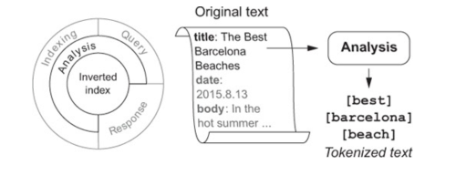

## Chapter 2 - Search Under the Hood

Search is a conversation between user and search engine
 - user attempts to satisfy an information need through constaints
 - search engine uses constraints to match and provide results

Search engine is mechanical, it is a dumb token matching

Science: Knowing how to extract features from queries and content
Art: What constitutes a good descriptive feature

### The Document
Documents are items being stored, searched and returned.  
Documents contain a set of fields named attributes of the document.

Strings are normally searched within (title, name, etc)

### Analysis

 - Converts fields into elements called tokens
 - Why? Token extracted from article must match query token to get a "hit"
 
### Data Structures
 - Search engine = collection of highly optimized data structures to be retrieved and scored.
 
 - Inverted Index - 
   - term dictionary: sorted list of all tokens
   - postings: documents that have the term
   
   - other data associated with the documents
     - Document Frequency - #of docs that have a particular term (length of postings).  High doc frequencies (like "the") carry less significance
     - Term Frequency - #of times term occurs in particular document, more occurances can consider more like your search 
     - Term positions, offset, payloads, stored fields, doc values
   
   
   

Analysis of a query has 3 steps
 - character filtering: ability to modify entire piece of text
 - tokenizing: chops up into stream of tokens
 - token filtering: modify/remove/insert tokens in the stream