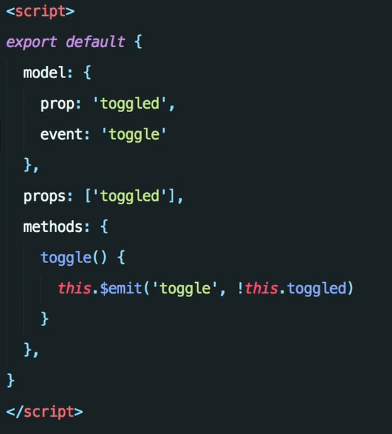
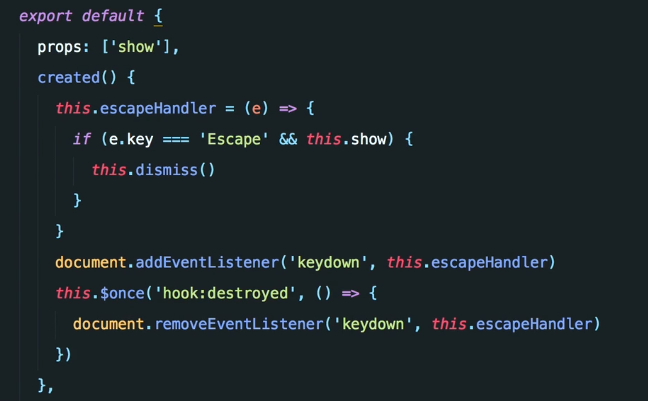
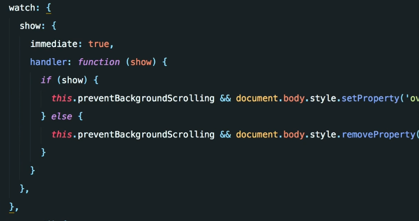

1. Controlled Components:
 - Does not have any of its own state
 - Value of child is controlled by the parent (passed via v-model)
 - Communicates new state through events

2. Customizing VModel
 - VModel is sugar for `:value="x" @input="handleInput"`
 - You can customize controlled components to emit names that are more clear for what they are doing
 - Example below, emits `toggle` and value of `toggled` but is able to communicate with vmodel using regular input/value

3. Wrap Component Libraries
 - Treat these as a controlled component
 - duh: use refs for selectors `input ref="name"` then `this.$refs.name`

4. Encapsulating Global Behavior: Modal close on Escape Button
 - Keep the global behavior as close the component as you can.  It is the concern of the component, not the app to close when escape is pressed.
 - Two options, either use the destroyed hook to removeEventListener, or use the better way of listening  in the created for setting up the listener
 - I think this is much better because it is in a single place, this could be included as a mixin or provided from the parent.

5. Encapsulating Global Behavior: Modal Scrolling on Body
 - no scrolling requires `overflow: hidden` on parent of the modal.
 - can accomplish on App and global isModalShown, couples
 - better, is to have the component be responsible for handling the global styling

