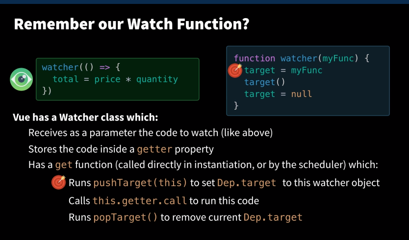

### Reactivity
In order to make reactivity work we creat an observer object (dep) with notify and subscribe.  The subscribe occurs when items are being computed and collected.  The are notified when the item that subscribed updates.

Implement the `tinyVue.spec.js`

### Template Compilation

Step 1 Compilation
 - Template to a render function

Step 2 Run render function
 - render function to vnode
 - vnode patch to dom

### Functional Components

They are way cheaper b/c they do not have a vue instance, Use cases from evan you
 - Leaf components (think buttons, text, etc)
 - Functional wrapper 
 
 Can’t have its own data, computed properties, watchers, lifecycle events, or methods.
Can’t have a template, unless that template is precompiled from a single-file component. That’s why we used a render function above.
Can be passed things, like props, attributes, events, and slots.
Returns a VNode or an array of VNodes from a render function. Unlike a normal component that has to have a single root VNode, it can return an array of VNodes.
 
### Component Mounting Process

mountComponent
 - if .el => $mount
  - if template compileToFunctions (eg templates to render functions)
    - function viewable as `app.$options.render` mapping to methods _v, _r is above
  - call original $mount function, which will _render 
  - [Diff current environment](https://programmer.help/blogs/5c10a81e407cf.html) and [patch if needed](https://github.com/vuejs/vue/blob/dev/src/platforms/web/runtime/node-ops.js)
  
   