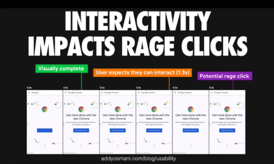
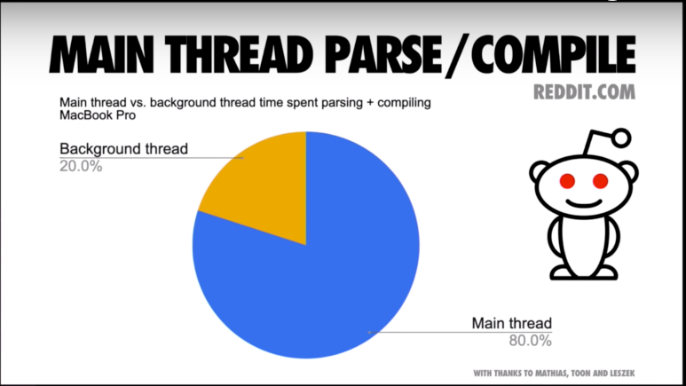

https://www.youtube.com/watch?v=X9eRLElSW1c

## Things to Remember

 - Javascript is CPU Bound
 - Mobile is a spectrum 2g/4g and 30$ to 1000$
 
Median site is 360kb and loads in 9 seconds 

When i am trying to interact with site but i can't, that causes rage clicks.

Design for resilience, JS can be a re

Be fast at Javascript
- Fast Download
- Fast Parse/Compile
- Fast execute

- Reduce JS
- Bundles down to 50kb
- *Avoid* Large inline scripts

### Streaming
Background thread time is where we parse/compile async/deferred scripts

Chrome starts to stream when a file is 30kb, so there is huge benefit to having multiple small bundles

### Split Bundles for Parallelization

https://markus.oberlehner.net/blog/how-to-drastically-reduce-estimated-input-latency-and-time-to-interactive-of-ssr-vue-applications/