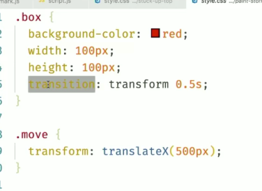
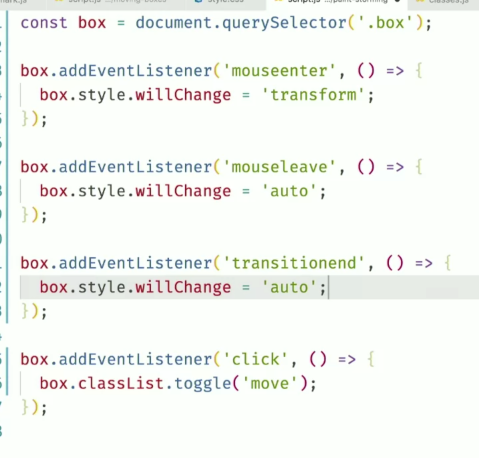

## https://frontendmasters.com/courses/web-performance

## Main Concepts
- Doing nothing is better than doing something
- Doing something later is better than now

### Threads
 - UI Thread: Chrome Itself (ui bar)
 - Renderer Thread (CPU Intensive): Main thread 1 per tab, does css, js 
 - Compositor Thread (GPU Intensive): Draws bitmap to screen through GPU

### Render Pipeline - All MainThread
 - Javascript
 - Style Calculation
 - Layout
 - Paint
 - Composite

### CSS

Css is compiled into the cssom.  It is not free
- class names (BEM) are better than complex selectors (.something vs '.sidebard > .ul:nth-child(4n:1)'

#### Avoid Reflows
Reflows are very expensive and main cause of bad performance on low end devices.  They block the loop and cause a repaint
- When Geometry of element changes, browser must reflow
- If you reflow an element, it reflows the children and then the parents

Reflow Causes:
- Window Resize
- Changing the Font
- Content Changes
- Add or remove a stylesheet
- Add or remove classes
- Add or remove element
- Changing orientation
- Calculating or Changing size or position

Preventing Reflow
- Change class at lowest level of dom tree
- Avoid repeatedly modifying inline styles
- Trade smoothness for speed when animating in js
- Avoid table layouts
- Batch DOM manipulations
- Debounce window `onresize` events

### Layout Thrashing (forced synchronous)
Occurs when js iteratively reads then writes to the dom

*Solution* Batch Reads, then Batch Writes

https://codepen.io/Austio/pen/qBWvXRb

```
// Before: Causes Thrashing because it is iteratively iterating on calculate style then change 
function doubleWidth(elm) {
  const width = element.offsetwidth;
  element.style.width = `${width * 2}px`;
}

boxes.forEach(doubleWidth)

// After: fixed
const widths = boxes.map((elm) => elm.style.width);
widths.forEach((width, i) => {
  boxes[i].style.width = `${width * 2}px`;
})

```

*Solution* [Fast Dom](https://github.com/wilsonpage/fastdom/blob/master/fastdom.js#L172)

Another option is to use requestanimationframe to handle thrashing so that you are only reading/writing 1 time per cycle (~16ms)

```
button.addEventListener('click', (event) => {
  boxes.forEach((element, index) => {
    fastdom.measure(() => {
      const width = element.offsetWidth;
      fastdom.mutate(() => {
        element.style.width = `${width * 2}px`;
      })
    });
  })
});

// fastdom.measure
```

### Painting
Any time you change anything other than opacity or a CSS Transform, you get a repaint.  Avoid this when possible.

Can view this active paints pressing CTL+Shift+P -> Rendering -> Checking Page Rendering box

### Layers (css will-change: transform)
You *can* suggest to the browser to use layers for areas, which reduces repainting.  Using a layer pushes work to the GPU where it just needs to shift layers relative to each other.  It is better when it is used well but does have overhead via having to keep shared memory between the Rendering Thread (CPU) and Compositor Thread (GPU)

The way you do that is with a css property `will-change: transform`

Can view layers by pressing CTL+Shift+P -> Show Layers

There is a non-zero cost with this, good rule of thumb
- Set this with javascript if they will do it sometimes (onenter set element.style.willChange = `transform` then on animationEnd set back to `auto` after)
- If it is constant interaction do it with css




### Network Side

cloudping.info

- Initial window size is 14kb, if you can get your file in that size it will be 1 request.