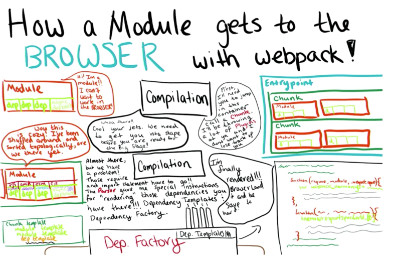

1. How does webpack collect dependencies?
 - When it parses the module with acorn into an AST.  It collects require/import statements and marks those as dependenies.

Webpack Plugins Workshop + [Webpack Contributing Blog Series 3rd](https://medium.com/webpack/the-contributors-guide-to-webpack-part-3-44cc149af02c)

### How the Dependency Graph Works
1. Initialize: With a valid config (compiler options).  The compiler returns a *compilation* based on your config.
2. The entry and each file are loaded in a breadth first search of
 - resolve the file (Tapable Resolver)
 - load the file (Tapable NormalModuleFactory)
 - parse and collect dependencies (Parser)
 - repeat
3. Once done we put the Module through a template to generate the files 



### Tapable

Tapable is the core webpack primative and provide a class that subscribes to events in order to do things.

#### Tapable instance

 - Compiler - Central Dispatch.  The compiler runtime.  Starting webpack, emitting files.  Hooks are like `run` and `emit`.
 - Compilation - The Brain.  The dependency graph and sealing/rendering.  The product of the webpack Compiler class. The Compiler returns Compilation with the *entire dependency graph* for your application.  Has hooks like `optimize-modules`, `seal` and `optimize-chunk-assets`. Any time optimizations and overall full program transforms and utilities will be performed on the Compilation.
 - Resolver(s) - The Bloodhound. Going to make sure the thing you are requesting exists.  `enhanced-resolve`.
 - NormalModuleFactory - Takes a resolved file and meta and loads the source code.  Lifecycle hooks that you would plugin to may include `before-resolve`, `after-resolve`, and `create-module`. In addition to this, loaders are run against every module and transforms them from their current file format into something that can be added into a webpack Chunk.
 - ContextModuleFactory - The purpose of the ContextModuleFactory is identical to the NormalModuleFactory except it is for ContextModules a special webpack module type that enables “dynamic” requires.
 - Parser - Tapable instance that uses acorn to turn the Modules (from NormalModuleFactory) into an AST.  Use the AST to collect dependencies (from require/import).  A reference to the parser lives on every NormalModule instance. Plugins that use the parser will utilize hooks for every lexical symbol type for the AST. Any of the plugins in our webpack core source code ending in ParserPlugin hooks into these events. 
 - Template - Because webpack performs code generation when it bundles, the Template instance is responsible for binding module data (via multiple template subclasses) to generate the shape and structure of the output bundles produced.  This is what produces the iife's around files, brackets in array, imports to webpack_require, dynamic imports into webpack_require__.e, etc
 - Template Subclasses - There are many levels of templates: MainTemplate (the runtime bundle wrapper), andChunkTemplate (the template that controls features likes the shape and format of the Chunk wrapper itself). Each source abstraction will contain its own template as well ( ModuleTemplate , DependencyTemplate ). Because of this, every Template subclass can be tapped into with module, render, and package hooks.

### Plugins

[Plugin API](https://webpack.js.org/api/plugins/)

#### What does a plugin do?

It implements and apply method that accepts a a compiler.
The complier provides plugin hooks that you use in order to subscribe to events.  Todo things async, accept the callback as an argument.

#### Register plugins

```js 
// Your Plugin
class MyFirstPlugin {
  apply(compiler) {
    compiler.plugin("run", function(compiler, cb) {
      console.log("webpack is about to start bundling");
      cb(); // cb() signals to the compiler that this asnyc hook is finished. 
    });
compiler.plugin("done", function(stats) {
      console.log("webpack is finished bundling");
    });  
  }
}

// Registering
compiler.apply(new MyFirstPlugin())
```

#### Major Components

 - webpack - The core repository. This is where a majority of the webpack source code lives.
 - webpack-dev-middleware - The NodeJs library-agnostic middleware client designed to allow webpack to deliver bundled assets to any development server. This library is the foundational component of webpack-dev-server.
 - webpack-dev-server - A lightweight Express implementation of webpack-dev-middleware with a nice Command Line Utility for ease of use.
 - memory-fs - A fully functioning in-memory alternative to NodeJs’s native fs. Perfect for implementing in-memory caching and fast data processing instead of writing/reading from disk.
 - enhanced-resolve - this package was isolated from the webpack source to be used a general purpose extensible resolver. All of webpack’s module resolution strategy (which is an extension of NodeJs’s native strategy) exists inside of enhanced-resolve.
 - tapable - Tapable is a small (~235 line) JavaScript plugin library. It is the backbone of webpack’s extensibility and is the magic behind webpack’s flexibility and modular design. It is very similar to NodeJs’s EventEmitter .
 - webpack-sources - webpack-sources is an Object-Oriented modeling for mutating and representing file sources and source maps. It is a small but important piece of webpack.
 - source-list-map - As mentioned above webpack-sources not only models a files source code, but also its transformed code and the source maps for it. The source mapping functionality is obtained from this package. A very simple API that you could leverage yourself in your own projects.
 - watchpack - This package is an abstraction on chokidar (TIL means ‘watchman’ in hindi) which handles all file watching for webpack.
 - loader-runner - Does exactly what it says! Run’s loaders you use in your configuration. The loader functionality in webpack can be used in any other tool you want via this package.
 - loader-utils - Contains a wonderful collection of utilities and convenience functions for tasks (like normalizing URL paths, etc) to make custom loader development easy and consistent.
 - node-libs-browser - A collection of native NodeJS shims and built-ins (like tls, crypto, etc.) that allow for NodeJS specific modules to work in the browser. This is used directly in webpack core to support bundling those types of modules.
 - webpack.js.org - Our new documentation page!!!! The creation of webpack 2 was more than just about new features and getting it released from beta. It was about a new learning experience tailored to first-time and veteran users alike.
 - webpack-canary - A library (work in progress) inspired by NodeJs’s Canary in the Gold Mine (CITGM). The goal of this tool is to pull down the top 100 loaders and plugins and NPM modules that use webpack, and run their tests off of nightly or pre-release builds of webpack. This is to help us catch edge-case bugs that we have less coverage or exposure to when making plugin and loader API changes.
 - webpack-cli - The “newest kid on the block”. `webpack-cli` is a project led by our webpack contributor-team and Even Stensberg. Their first complete milestone hasn’t yet been decided, but there are a few things they want to solve: Scaffolding, codemod’s for graceful migrations from v1-v2-vx, and an api to help build extensible plugins or add-ons.
 - Core loaders and plugins - a set of loaders and plugins that we have procured for the community’s satisfaction. Includes (but not limited to): css-loader, style-loader, html-loader, file-loader, url-loader, worker-loader, raw-loader, extract-text-webpack-plugin.