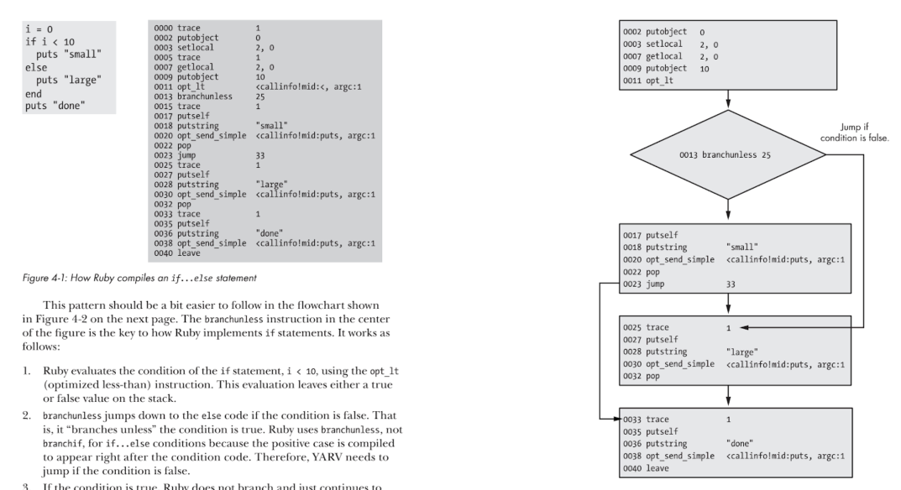
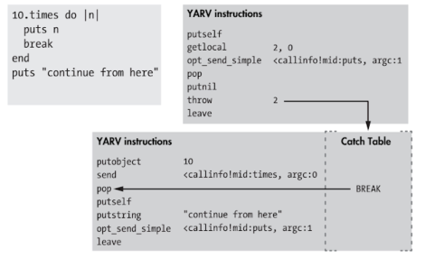
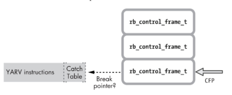

### Chapter 4 - Control Structures and Method Dispatch

YARV handles control with three primary instructions `branchunless`, `branchif` and `jump`

#### Jump/Branchunless

 - Ruby gets to 11 and evaluations opt_lt, this leaves either true or false on stack
 - branchunless (branch unless true) sees that
   - if stack is false, branches and goes to instruction 25
   - if stack is true, continues to 15, evaluates, ends up on 23 which jumps to 33
 
 
#### Leaving a Scope 

- Ruby is dynamic, you can break in any scope.  
- In the below code, ruby needs to be able to exit the loop and continue with the last ruby command in the parent scope.
- To handle YARV uses `throw`, which acts similarly to the Ruby throw keyword

 

To handle the throw YARV uses the concept of a `catch table` in each scope.  They contain a single pointer to where execution should continue after an exeception.  When ruby runs into the thow it
-Iteratres through all of the `rb_control_frame_t` in the stack 

