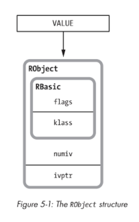
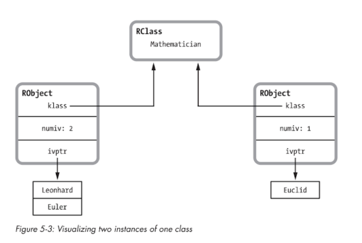
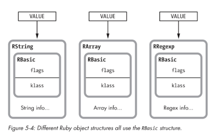
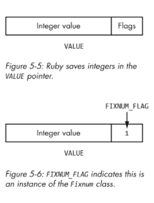
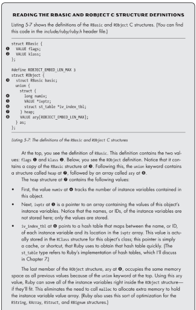
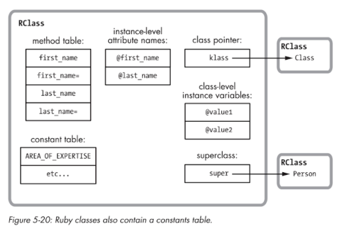
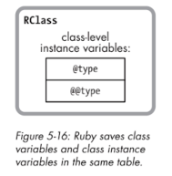
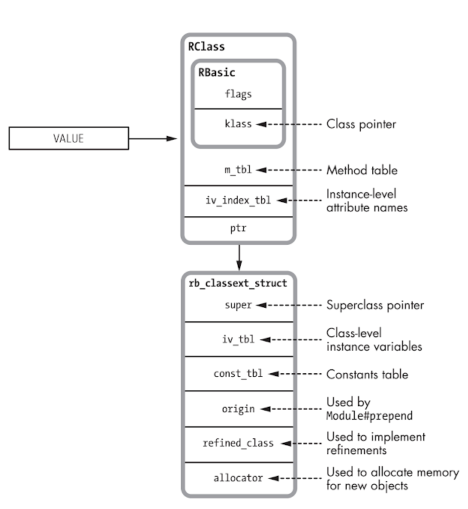
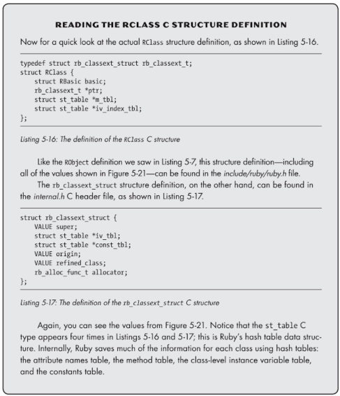
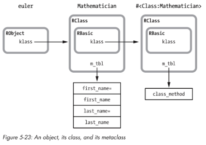

### Chapter 5 - Objects and Classes
 
Every Ruby object 
 - is the combination of a class pointer and an array of instance variables

Every Ruby class
 - is a Ruby object 
 - contains a group of method definitions 
 - contains a table of attribute names 
 - has a superclass pointer
 - has a constants table

#### RObject

RObject only used to save instance of custom object classes and a few custom object classes.  

 
 
`RObject` c struct holds custom objects and objects
- RBasic
  - klass - What class is this an instance of
  - flags
- numiv - the number of instance variables
- ivptr - pointer to the table that holds instance variables
- st_table - pointer to the has holding the name/id of each ivar and the location of it in the array 
 
```
class Mathematician
  attr_accessor :first_name
  attr_accessor :last_name
end  

# Below the hex string is actually the VALUE pointer for the object 
jim = Mathematician.new
=> #<Mathematician:0x007ff9a9518448>
```

Putting it together with IVars and multiple instances looks like this


#### Generic Objects (int, string, etc)

Every Ruby Value is an object, ruby calls basic data types (integer, string, symbol) "Generic" and handles them differently to optimize performance.

RString, RArray, RRegexp are implemented independently of RObject.  The Generics al share an RBasic information.



With these generic types, ruby goes a step further for optimizations, in cases where it is possible, they use the VALUE pointer to hold the actual value and use the first few bits to hold a flag to represent that it is a real value and not a pointer to a class.



*NOTE:* Since every Object in ruby has ivars, ruby has to hack in order to give these Generic objects IVars.  It keeps a hash called `generic_iv_tbl` and it maintains a map between the generic objects and the pointers to other hashes that contain the IVars



#### How does ruby allocate new IVars?

Ruby saves values for ivars in a simple array but to avoid pre-allocating ivar space that may not be used, ruby only allocates blocks like a slice in golang.

The affect is that ivar adding speed can vary, if the array is fully, ruby will allocated 3 extra spots for ivars and that takes time. If the array is not full it will just insert

#### Ruby Class



Class structure allows for the definition at beginning of readme for ruby class.

InstaceOf: klass - Specifies the object that this is an instance of, all Classes are a class of the `class` class #giggle 
Inheritance: superclass - Specifying a superclass or by default getting the Object class.

klass -> things like new, and 
superclass -> lookups on instances of this class

###### Class instance variables and class variables

@ivars - single @ allocated for each instance of this class or subclasses
@@class_variables - two @@ allocated once and shared
```
class Mathematician
  @ivar = "ivar Math"  
  @@class_var = "class var Math"
  
  def self.ivar
    @ivar
  end
  
  def self.class_var
    @@class_var
  end
end

class Statician < Mathematician
  @ivar = "ivar Stat"  
  @@class_var = "class var Stat"
end

[18] pry(main)> Mathematician.ivar
=> "ivar Math"
[19] pry(main)> Statician.ivar
=> "ivar Stat"
[20] pry(main)> Mathematician.class_var
=> "class var Stat"
[21] pry(main)> Statician.class_var
=> "class var Stat"
```

|Action|Algorithm|
|---|---|
|Get/Set Class instance variables|Looks up the variable in RClass and saves or retrieves|
|Get/Set Class Variables|Search Superclasses for the variable, if found get/set, if not use local one in RObject|

This data is saved in RClass




Ruby uses two structures for each class, RClass and rb_classext_struct  RClass always points to the struct and 

|Item|?|
|---|---|
|flags, klass|Same as RBasic that every Ruby value has|
|m_table|method table, hash whose keys are ids/names of each method and compiled YARV|
|iv_index_tbl|attribute name table, hash maps each ivar to index in the ivar array in RObject|
|super|pointer to RClass for superclass|
|iv_tbl|class ivars and class level variables (@ and @@|
|const_tbl|hash of all names/values for constnat in the class scope, similar to iv_tb, class level ivars and constants are almost the same|
|origin|handles prepend|
|refined_class|refinements|
|allocator|allocating instance of new object|



###### Where do class level methods go?



```
ObjectSpace.count_objects[:T_CLASS]
# 559

class Foo; end;

ObjectSpace.count_objects[:T_CLASS]
# 563

a = Foo.new

p a.singleton_class.methods
```

When we create a new class, we actually get multiple classes.  One is the meta class that holds the class methods.
