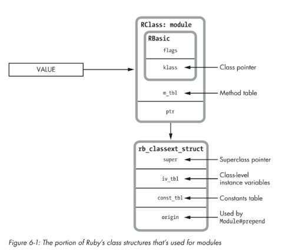

### Chapter 6 - Method and Constant Lookup

 - Ruby implements inheritance using the `super` pointer in `RClass`

#### Modules

A ruby module
- is an object
- contains method definitions
- has a superclass pointer 
- has a constants table

Different from classes in that
- can't instantiate from them, new doesn't exist on Module
- can't specify superclass
- includable into classes

So really you don't need 
 - `iv_index_tbl` -> no new, so no instances
 - `refined_class` or `allocator`

Implemented using RClass/rb_classext_struct but can't use refined_class, allocator or super


Under the hood when you `include` a module (ruby refers to this as the included class).  
 - The super pointer of your RClass module is pointed to what the RClass class is pointed to
 - The super pointer of your RClass class is pointed to the RClass module 
 
The module that is put in the tree is a COPY of the original module, which is why `super` pointers point correctly when you include the same module in multiple classes 
 
This is why when you include multiple modules, the last included one is the first one looked for, the super pointes are pushed onto the class they are included. 
 
`extend` is implemented in the exact same way only on the RClass of the class's class 
 
#### Method Lookup 
 
This simple in inheritance model using RClass with a super pointer allows the method lookup to be simple.
 1. Set current class to receiver
 2. Look through method table in current class
 3a. If found call 
 3b. else, set current class to what `super` points to and goto 2
 
```
module Professor
  def lectures; end
end

class Person
  attr_accessor :first
  attr_accessor :last
end

class Mathematician < Person
  include Professor
end

ram = Mathematician.new
ram.first = "Ram"
```

Ruby has to find `first=` method
 - ram is an `RObject` whose `klass` pointer is pointing to the `RClass` of Mathematician
 - Look in `m_tbl` of Mathematician `RClass` for `first=`
 - Not found, follow super of Mathematician `RClass`, which is pointing to Professor
 - Look in `m_tbl` of Professor `RClass` for `first=`
 - Not found, follow super of Professor `RClass`, which is pointing to Person
 - Look in `m_tbl` of Person `RClass` for `first=`, *BINGO*
 
#### Multiple Inheritance

Because Modules are really Classes, ruby supports multiple inheritance using Modules and also keeps it more sane in that you know exactly how things are going to be found because of the single list of ancestors.

Here is a more complex example.  

```
module Professor
  # RClass of Professor points to Employee
  include Employee 
end

class Mathematician < Person
  # RCLASS Mathematician super points to professor, which is a copy of above module
  include Professor
  
  # RClass of copied Professor points to Employee, which is a copy of Employee module
  include Employee
end
```

[Multiple Inheritance Example](./img/06_Multiple_Includes_Inheritance.png)

#### Prepend

Refresh: `prepend Module` vs `include Module` causes method lookup to start at prepended module first instead of the RClass which is defined, then after that lookup things progress normally. 

###Caching
 
#### Global Method Cache  
- In large linked lists method lookup can be expensive
- so ruby keeps a cache when it looks things up
 
|klass|defined_class|
|---|---|
|Fixnum#times|Integer#times|

#### Inline Method Cache
[Inline Method Cache](./img/06_inline_method_cache.png)
- Saves info in YARV instructions
- Saves mapping between the `times` method and the Integer#times lookup directly

#### Cache Busting
- ruby must clear the cache to make sure lookups are correct when, this happens frequently
- when `define` or `undefine` a method
- include a module in a class
- use refinements
- perform a similar action

