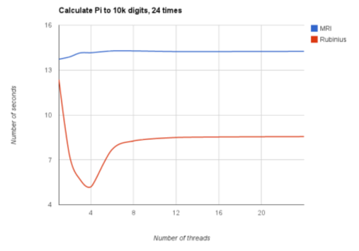

### Working with Ruby Threads

Understand how ruby can take advantage of multiple CPU cores.

#### Definitions

 - Process: Program in memory, has register,counter,stack, heap and code
 - Thread: Unit of execution in a process
 - Critical Section: The code in execution path that is shared
 - Mutex: Synchronizing access to an exclusive shared resource
 - ConditionVariable: Signal 1 (or many) threads that some event has happened.  Like an event bus for threads.
  
#### Thread Api (see chapter 1-3 for examples)
 - Thread.main
 - Thread.current
 - (cp1) Thread.new {} # creates and returns a new thread, yields self to block
 - (cp1) Thread.join #join blocks until all threads exit, marries exceptions to current thread
 - Thread.value # joins threads then returns last return value
 - (cp3) Thread.status # `run`, `sleep`, `false` - successfully ran to completion, `nil` - ran but with exception, `aborting` - running but dying
 - (cp3) Thread.stop / Thread.wakeup - stops a thread until
 - Thread.pass - Signals to OS would prefer to stop, not guaranteed
 - Thread.raise - allows one thread to kill another, don't use this, it doesn't run ensure blocks and stack trace is from the parent
 - Thread.kill - stops a thread, same caveats as Thread.raise
 
#### Mutex API (Chapter 9+)
 - Mutex.lock  
 - Mutex.unlock  
 - Mutex.synchronize(&block) - runs block, lock/unlock around it
 - Mutex.try_lock - will check if a mutex is already locked, acquiring if it is not locked and returning false otherwise
 
#### ConditionVariable API (Chapter 10)
 - ConditionVariable.wait(mutex) lets other threads run, used inside of a locked mutex
 - ConditionVariable.signal - Tells mutex paused by condition variable  to run.  Essentially, wake up 1 thread that is waiting
 - ConditionVariable.broadcast - Like signal but for all waiting threads
  
#### Chapter 1 - Always in a thread
By default there is always 1 thread, the main one.  In ruby when this exits all children threads exit.

```rb
Thread.new { Thread.current == Thread.main }.value
=> false

# start of program
thread = Thread.new { "do lots of work" }

# Have to sleep to prevent main thread from exiting, which could cause child to exit
sleep
```

### Chapter 2 - Threads of Execution

Threads have shared address space: AST (compiled ruby code) and Memory (variables) 

Anything that has a multistep assignment is not thread safe: ||=, Arrays

Ruby Threads map to native threads, threads can be paused and restarted at any time by the OS to ensure fair execution, so we have no way to ensure contiguous flow of execution

Example below fails in this way with two files
 - File 1 creates thread A
 - File 2 creates thread B
 - thread A calls results, begins to look for @results as part of ||=, creates new array, before assignment is paused
 - thread B calls results, begins to look for @results as part of ||=, creates new array and assigns then finishes, @results is [File 2 results]
 - thread A wakes up and finishes assignment then finishes, @results is overwritted to [File 1 results]
 - *boom* we just lost File 2 results

Fix here is to initialize @results eagerly in initialize, not lazily so that we don't have the lookup
```rb
require 'thread'
require 'uploader'
class Upload
  def call(files)
    threads = []
    
    files.each do |f|
      threads = Thread.new do 
        results << Uploader.new(thread)
      end  
    end
    
    threads.join
  end

  def results
    @results ||= []
  end
end
```

Any time that two threads can modify the same data, you can have trouble

#### Chapter 3 - Lifecycles of a thread

 - exceptions in child thread have no affect on parent
 
```rb
t = Thread.new { raise 'hell' }
# all good

t.join
=> RuntimeError: hell
=>        from (irb):7:in `block in irb_binding'

```

 - start/wakeup
```rb
t = Thread.new { Thread.stop; puts "hiya"; }
nil until t.status == "sleep"
t.wakeup
t.join
``` 

#### Chapter 4 - Concurrent vs Parallel
Threads run code concurrently, they could do them in parallel.  Making concurrent code enables parallelization, but does not guarantee it will be executed in parallel, that is the job of the OS scheduler.

 - [Rob Pike: Concurrency is not parralel](https://blog.golang.org/concurrency-is-not-parallelism)
 - [Evan Phoenix Ruby Parallel](https://www.engineyard.com/blog/author/evan-phoenix)

Imagine you have 2 1 day projects, A and B
 - Serially: Do project A then Project B
 - Concurrently: Project A half day, then Project B half day, repeat next day
 - Parallel: You do Project A, another programmer does Project B
 
#### Chapter 5 - GIL and MRI
MRI Global Interpreter Lock (GIL) does not allow parallel execution of ruby code.  It wraps each process in the GIL which prevents Parallel execution of ruby code in MRI.

However, this does not affect blocking IO or anything written in native C.  

```rb
# Will lock GIL due to ruby lock in MRI
3.times.map do 
  Thread.new { Digest::MD5.hexdigest(rand) }
end.each(&:value)
 
# Will not block, uses ppoll(2) to be notified when ready
3.times.map do 
  Thread.new { open('zmodo.com') }
end.each(&:value)
```

Reason given for GIL
 1. Protects MRI from race conditions
 2. Facilitate C Extensions: These both lock the gil
```rb   
# Ruby
a = Array.new
a.pop

# C
VALUE a = rb_ary_new()
VALUE last_element = rb_ary_pop(a)
```
 3. Protect your code from race conditions
 
MYTH 1: GIL Guarantees Thread Safety
 - wrong +=, this only keeps thread safety if you prevent parallelism
 
```rb
# Example demonstrating thread safety issue 
@counter = 0

5.times do 
  Thread.new do 
    temp = @counter
    temp += 1
    @counter = temp
  end
end.each(&:join)
``` 

MYTH 2: GIL Prevents Concurrency
 - wrong, it prevents parallelism of ruby code
 - concurrent execution of ruby code is fine
 - parallel execution of blocking io is fine
 
#### Chapter 6 - Rubinius and JRuby and How Many Threads
 
Rubinius and JRuby don't have a gil.  JRuby doesn't support C API (java).  Rubunius does but instead of enforcing GIL it opts to help/let authors fix.

#### Chapter 7 - How Many Threads are Too Many?

 - OSx has something like a 2000 thread limit
 - Linux is a beast, 
```rb 
1.upto(10_000) do |i| 
  Thread.new { sleep }
  puts i
end
``` 
 
You have to balance the cost of switching threads and extra memory of thread vs cost of running in the same process.  For I/O Bound threads (network, disk writing, etc) it makes sense to have many threads b/c the bottleneck is the waiting.  For CPU bound (hashing md5) more threads will only give you better results up to the number of CPUs/cores you have.

|IO Bound (hitting new york times)|CPU Bound (Complex Math)|
|---|---|
|||

#### Chapter 8 - Thread Safety

Thread safety means that you can mutate the shared process memory in a way that keeps your program's data safe, consistent and semantically correct.

When you are not thread-safe, the underlying data can become incorrect.

Any concurrent operations to the same data are not thread safe

```rb 
# classic check then set thread safety issue

# below may (should?/could?) ouput
# collected
# collected

Order = Struct.new(:amount, :status) do
  def pending?
    status == "pending"
  end
  
  def collect_payment
    puts "collecting"
    self.status = "collected"
  end
end

o = Order.new(100, "pending")

5.times.map do 
  Thread.new do
    if order.pending?
      # key operation here is multistep, which is what causes the issue
      # this needs to be in a mutex or a single step in the thread
      order.collect_payment
    end
  end
end.each(&:join)
```

#### Chapter 9 - Protecting with Mutexes

Mutexes allow safe concurrent access by only allowing one thing to change at a time.  Only the locking thread can unlock the mutex.  To be effective they must be shared among all the threads.  Code that 

```rb
order = Order.new(100, "pending")
require 'thread'
mutex = Mutex.new

5.times.map do 
  Thread.new do
    mutex.lock
      if order.pending?
        order.collect_payment
       end
    mutex.unlock   
  end
end.each(&:join)
```

More commonly people will use `Mutex.synchronize(&block)`

If you are setting a variable while holding a mutex, you should also wrap the getter in a mutex to ensure that they always have the most up to date value.

Most programs like [go](https://golang.org/ref/mem) have memory models to help with understanding memory issues.  Ruby has no such model, which is why it can be difficult to grok sometimes in multi threaded situations.

```rb
# this line guarantees a "memory barrier" so that the status is synced to main memory before it is read.  ow could end up in l1/l2 cache weirdness 
status = mutex.synchronize { order.status }
if status == 'paid'
end
```

Put as little code in your critical section as possible.  Just enough to keep data fine and dandy it inhibits parallelism while it is holding the lock.

```rb
# Overly mutex'ed
mutex.synchronize do
  response = Net::HTTP.get_response(...)
  results << response
end

# Better
response = Net::HTTP.get_response(...)
mutex.synchronized do 
  results << response
end
```

Deadlocks occur when one thread blocks waiting for another resource that it can't acquire, resulting in the program not being able to continue.  

 - Thread A locks Resource A
 - Thread B locks Resource B
 - Thread A needs Resource B to continue
 - Thread B needs Resource A to continue

Livelocks occur when two threads continuously try to lock 2 mutexes that they both acquire the first two then release.

 - Thread A locks Resource A
 - Thread B locks Resource B
 - Thread A needs Resource B to continue, sees it is locks releases
 - Thread B needs Resource A to continue, sees it is locks releases
 
#### Chapter 10 - Conditional Variables

Conditional variables are used to dispatch events to threads when something happens.

I this example we have a thread that fetches urls and a thread that collects them.  The collector uses the ConditionVariable.wait(mutex) to allow the fetcher thread to work, meanwhile the ConditionVariable.signal is used in the fetcher thread to let the collector know there are results to process.
```rb
require 'thread'
require 'net/http'

mutex = Mutex.new
condvar = ConditionVariable.new
results = Array.new

# Background Thread Fetches Comics
Thread.new do
  10.times do 
    r = Net::HTTP.get_response('https://c.xkcd.com', '/random/comic')
    url = r['Location']
    mutex.synchronize do
      puts "#{results.length} results push then signal before"
      results << url
      condvar.signal
      puts "#{results.length} results push then signal before"
    end
  end
end

comics_received = 0

# Main thread collects results
until comics_received > 10
  mutex.synchronize do 
    while results.empty?
      puts "#{results.length} condvar signal before"
      condvar.wait(mutex)
      puts "#{results.length} condvar signal after"
    end
    
    url = results.shift
    puts "you should checkout #{url}"
  end
  
  # notice this is incremented outside of mutex, that is b/c it is only used in 1 spot
  comics_received = comics_received + 1
end
```