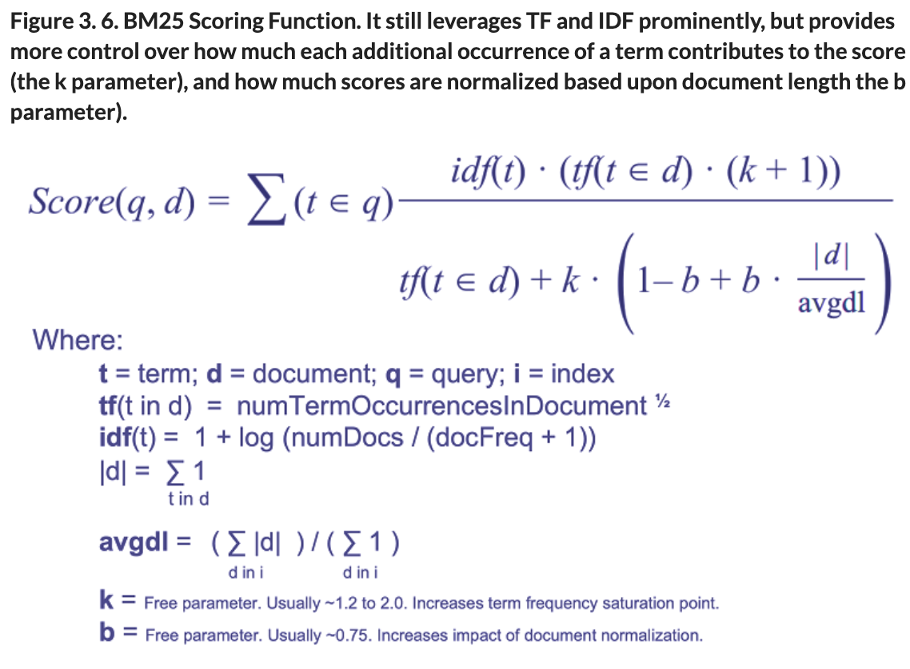

## [AI Powered Search](https://manning.com/book/ai-powered-search)

Links
 - [Solr Function](https://solr.apache.org/guide/8_3/function-queries.html)
 - [Solr in Action: CP7 Complex Queries](https://livebook.manning.com/book/solr-in-action/chapter-7)


Definitions
 - Polysemy: An ambiguous word, can have multiple meanings.  Think driver (automobile, golf club, computer, something pushing you "driver of success")
 - Vector: Collection of attributes for instance price, size and bedrooms of a house [100000,1400,3],[120000, 1500,4]
 - Vector Representation: A subset or view of the vector used for making calculations (sparse representation, dense representation)  
 - Dimensions: A specific set of vectors
 - Vector Space: Specific collection dimensions
   
 - Word Embeddings
   - add more context to vectors, for instance in an inverse index, apple joice would get matches for apple and juice.  However it would not match for drink or surgary drink. 
   - Word embeddings give us the ability to attach more context and "stength" to a match.  Instead of just apple and drink we can add N points for things that are related to it.
   - Once you have this, then you can do the dot product on the vectors for things to find out "similar" things are
   - really contextual search will pull out `Sentence Embeddings`, `Paragraph Embeddings`, `Page Embeddings`
    
For Modeling a DSL we have several things
 - Alternative Labels: identical meaning, replacement
   - Obvious acronyms, misspellings, alternatates
 - Synonyms: simliar, expansion, 
 - Taxonomy: classification into categories, parent child heirarchy
   - Creating a heirarchy.  Applied during search to only show some facets or drill down to a subset of results.  For instance showing ovens when someone searches "range" at home depot website
 - Ontology: Mapping of relationships between types of things (animal eats food, human is animal)
   - Thisis more about relationships, think neo4j, Person is Boss of Other, CMO is employee, etc
 - Knowledge Graph: Instance of ontology containing things that are related

### Natural Language

Due to polysemy, each term takes on new meaning based on specific context in which it is used.

Personalization is super hard and the last thing to do (i.e. boosting apple watches in results because the user has an ipohone)

### CP2

Data is not unstructured, it is hyper-structured and represents a giant graph of domain-specific knowledge.
Search engines can interpret the semantic relationships between terms and phrases based upon the distributional hypothesis and harness rich meaning for character sequences, terms, term sequences (typically phrases), fields, documents, document sets, and an entire corpus.
Distributional semantics approaches enable us to learn the nuanced meaning of our queries and content from their larger surrounding context.
Domains are commonly modeled through alternate labels, synonyms, taxonomies, ontologies, and knowledge graphs. Knowledge graphs use all preceding to model a particular domain.
Content and user signals are both important fuel for our AI-powered search to help solve natural language challenges.

# CP3

Scoring is through calculating the cosign (size of the angle) between two vectors.

### With Dense vectors

Replace the documents with a representation of the features you care about (apple juice)

```
[a, and, apple, apples, avocado, award, best, brian, cheese, chicken, chips,
chocolate, concentrate, cookie, cup, farms, for, freshest, from, fruit,
grilled, ham, has, ice, in, is, its, juice, lemonade, lynn, made, mohammed,
never, orchard, organic, plain, potato, premium, received, regional, row,
salad, sandwich, the, three, turkey, water, years]
query_vector = np.array([0, 0, 1, 0, 0, 0, 0, 0, 0, 0, 0, 0, 0, 0, 0, 0, 0,
0, 0, 0, 0, 0, 0, 0, 0, 0, 0, 1, 0, 0, 0, 0, 0, 0, 0, 0, 0, 0, 0, 0, 0, 0,
0, 0, 0, 0, 0, 0])

Lynn: ham and cheese sandwich, chocolate cookie, ice water.
Brian: turkey avocado sandwich, plain potato chips, apple juice
Mohammed: grilled chicken salad, fruit cup, lemonade
doc1_vector = np.array([0, 1, 1, 0, 1, 0, 0, 1, 1, 1, 1, 1, 0, 1, 1, 0, 0,
0, 0, 1, 1, 1, 0, 1, 0, 0, 0, 1, 1, 1, 0, 1, 0, 0, 1, 1, 1, 0, 0, 0, 0, 1,
1, 0, 0, 1, 1, 0])

Orchard Farms apple juice is premium, organic apple juice made from the
freshest apples, never from concentrate. Its juice has received the
regional award for best apple juice three years in a row.
doc2_vector = np.array([1, 0, 1, 1, 0, 1, 1, 0, 0, 0, 0, 0, 1, 0, 0, 1, 1,
1, 1, 0, 0, 0, 1, 0, 1, 1, 1, 1, 0, 0, 1, 0, 1, 1, 0, 0, 0, 1, 1, 1, 1, 0,
0, 1, 1, 0, 0, 1])

def cos_sim(vector1, vector2):
return dot(vector1, vector2) / (norm(vector1) * norm(vector2))

doc1_score = cos_sim(query_vector, doc1_vector)
doc2_score = cos_sim(query_vector, doc2_vector)

print("Relevance Scores:\n doc1: " + num2str(doc1_score) + "\n doc2: "
+ num2str(doc2_score))
```

### Sparse Vector

These exclude everythign that is not relevant

```
sparse_query_vector = [1, 1] #[apple, juice]
sparse_doc1_vector = [1, 1]
sparse_doc2_vector = [1, 1]

doc1_score = cos_sim(sparse_query_vector, sparse_doc1_vector)
doc2_score = cos_sim(sparse_query_vector, sparse_doc2_vector)

print("Relevance Scores:\n doc1: " + num2str(doc1_score) + "\n doc2: "
+ num2str(doc2_score))
```

### Term Frequency

The above values are the same, so it really doesn't help.

Instead of using 1 for all instances of apple and juice lets add term frequency, how many times the words show up in the document.

To make this better we dampen it, by putting the number of accurances as a square root over the number of terms in the documnet.

```
doc1_tf_vector = [1, 1] #[apple:1, juice:1]
doc2_tf_vector = [3, 4] #[apple:3, juice:4]

query_vector = [1, 1] #[apple:1, juice:1]

doc1_score = num2str(cos_sim(query_vector, doc1_tf_vector))
doc2_score = num2str(cos_sim(query_vector, doc2_tf_vector))

print("Relevance Scores:\n doc1: " + str(doc1_score) + "\n doc2: "
+ str(doc2_score))

Relevance Scores:
 doc1: 1.0
 doc2: 0.9899
```

```
doc1 = "In light of the big reveal in the interview, the interesting thing
is that the person in the wrong probably made the right decision in
the end."
doc2 = "My favorite book is the cat in the hat, which is about a crazy cat
in a hat who breaks into a house and creates a crazy afternoon for
two kids."
doc3 = "My careless neighbors apparently let a stray cat stay in their
garage unsupervised, which resulted in my favorite hat that I let them
borrow being ruined."

def tf(content, term):
   tokenized_content = tokenize(content)
   term_count = tokenized_content.count(term.lower())
   # return float(term_count)
   # IMPORTANT: dampening This is a dampenting to make sure many occurences don't have an outsized impact on the score
   return float(np.sqrt(term_count)) / float(vector_length)

doc1_tf_vector = [ tf(doc1,"the"), tf(doc1,"cat"), tf(doc1,"in"),
tf(doc1,"the"), tf(doc1,"hat") ]
doc2_tf_vector = [ tf(doc2,"the"), tf(doc2,"cat"), tf(doc2,"in"),
tf(doc2,"the"), tf(doc2,"hat") ]
doc3_tf_vector = [ tf(doc3,"the"), tf(doc3,"cat"), tf(doc3,"in"),
tf(doc3,"the"), tf(doc3,"hat") ]

print ("labels: [the, cat, in, the, hat]")
print ("doc1_vector: [" + ", ".join(map(num2str,doc1_tf_vector)) + "]")
print ("doc2_vector: [" + ", ".join(map(num2str,doc2_tf_vector)) + "]")
print ("doc3_vector: [" + ", ".join(map(num2str,doc3_tf_vector)) + "]\n")

query = "the cat in the hat"
query_vector = np.maximum.reduce([doc1_tf_vector, doc2_tf_vector,
doc3_tf_vector])
print ("query_vector: [" + ", ".join(map(num2str,query_vector)) + "]\n")

doc1_score = cos_sim(query_vector, doc1_tf_vector)
doc2_score = cos_sim(query_vector, doc2_tf_vector)
doc3_score = cos_sim(query_vector, doc3_tf_vector)

print("Relevance Scores:\n doc1: " + num2str(doc1_score) + "\n doc2: "
+ num2str(doc2_score)+ "\n doc3: " + num2str(doc3_score))

## result 

labels: [the, cat, in, the, hat]
doc1_vector: [6.0, 0.0, 4.0, 6.0, 0.0]
doc2_vector: [2.0, 2.0, 2.0, 2.0, 2.0]
doc3_vector: [0.0, 1.0, 2.0, 0.0, 1.0]

query_vector: [6.0, 2.0, 4.0, 6.0, 2.0]

Relevance Scores:
 doc1: 0.9574
 doc2: 0.9129
 doc3: 0.5
 
## result with dampenting
labels: [the, cat, in, the, hat]
doc1_vector: [0.0942, 0.0, 0.0769, 0.0942, 0.0]
doc2_vector: [0.0456, 0.0456, 0.0456, 0.0456, 0.0456]
doc3_vector: [0.0, 0.0385, 0.0544, 0.0, 0.0385]

query_vector: [0.0942, 0.0456, 0.0769, 0.0942, 0.0456]

Relevance Scores:
 doc2: 0.9222
 doc1: 0.9559
 doc3: 0.5995 
```

### Inverse Document Frequency

This is how we pull out things like in/the as being really common and not super important and boost things that aren't super common like elasticsearch or grut 

idf = 1 + log( Documents + 1 / Document Frequency(term) + 1)

```
def tf_idf(tf,idf):
    return tf * idf**2

query = "the cat in the hat"

print ("labels: [the, cat, in, the, hat]")
doc1_tfidf = [
               tf_idf(tf(doc1, "the"), idf("the")),
               tf_idf(tf(doc1, "cat"), idf("cat")),
               tf_idf(tf(doc1, "in"), idf("in")),
               tf_idf(tf(doc1, "the"), idf("the")),
               tf_idf(tf(doc1, "hat"), idf("hat"))
             ]
print("doc1_tfidf: " + vec2str(doc1_tfidf))
s
doc2_tfidf = [
               tf_idf(tf(doc2, "the"), idf("the")),
               tf_idf(tf(doc2, "cat"), idf("cat")),
               tf_idf(tf(doc2, "in"), idf("in")),
               tf_idf(tf(doc2, "the"), idf("the")),
               tf_idf(tf(doc2, "hat"), idf("hat"))
             ]
print("doc2_tfidf: " + vec2str(doc2_tfidf))

doc3_tfidf = [
               tf_idf(tf(doc3, "the"), idf("the")),
               tf_idf(tf(doc3, "cat"), idf("cat")),
               tf_idf(tf(doc3, "in"), idf("in")),
               tf_idf(tf(doc3, "the"), idf("the")),
               tf_idf(tf(doc3, "hat"), idf("hat"))
             ]
print("doc3_tfidf: " + vec2str(doc3_tfidf))

query_tfidf = np.maximum.reduce([doc1_tfidf, doc2_tfidf, doc3_tfidf])

doc1_relevance = cos_sim(query_tfidf,doc1_tfidf)
doc2_relevance = cos_sim(query_tfidf,doc2_tfidf)
doc3_relevance = cos_sim(query_tfidf,doc3_tfidf)

print("\nRelevance Scores:\n doc2: " + num2str(doc2_relevance)
                       + "\n doc3: " + num2str(doc3_relevance)
                       + "\n doc1: " + num2str(doc1_relevance))
                       
labels: [the, cat, in, the, hat]
doc1_tfidf: [0.1041, 0.0, 0.094, 0.1041, 0.0]
doc2_tfidf: [0.0504, 1.4282, 0.0557, 0.0504, 1.7983]
doc3_tfidf: [0.0, 1.2041, 0.0664, 0.0, 1.5161]

Relevance Scores:
 doc2: 0.9993
 doc3: 0.9979
 doc1: 0.0758                       
```

### BM25



From

```
# In lucene create a collection
import sys
sys.path.append('..')
from aips import *

collection = "cat_in_the_hat"
create_collection(collection)

#Ensure the fields we need are available
upsert_text_field(collection, "title")
upsert_text_field(collection, "description")

docs = [
    {
        "id": "doc1",
        "title": "Worst",
        "description": "The interesting thing is that the person in the
        wrong made the right decision in the end."
    },
    {
        "id": "doc2",
        "title": "Best",
        "description": "My favorite book is the cat in the hat, which is
        about a crazy cat who breaks into a house and creates a crazy
        afternoon for two kids."

    },
    {
        "id": "doc3",
        "title": "Okay",
        "description": "My neighbors let the stray cat stay in their garage,
        which resulted in my favorite hat that I let them borrow being
        ruined."
    }
]
print("\nAdding Documents to '" + collection + "' collection")
response = requests.post(solr_url + collection + "/update?commit=true",
  json=docs).json()
print("Status: " "Success" if response["responseHeader"]["status"] == 0
  else "Failure" )  
  
### Make a request with Rank
query = "the cat in the hat"
request = {
    "query": query,
    "fields": ["id", "title", "description", "score",
      "[explain style=html]"],
    "params": {
      "qf": "description",
      "defType": "edismax",
      "indent": "true"
    }
}

from IPython.core.display import display,HTML
display(HTML(
    "<br/><strong>Query: </strong><i>" + query
    + "</i><br/><br/><strong>Ranked Docs:</strong>"))

response = str(requests.post(solr_url + collection + "/select",
  json=request).json()
               ["response"]["docs"]).replace('\\n', '').replace(", '",
                ",<br/>'")
display(HTML(response))
```

#### Customizing BM25

You can customize BM25 with functions.  This is important for bootsting relevant things like
 - Geospatial Location
 - Dates
 - Popularity
 - Specific Fields
 - Categories
 - Specific Phrases
 - Semantic Expansion

This can be accomplished with the edimax and 
- Boost single parts, title > description: 
  `q={!type=edismax qf="title^10 description^2.5"}the cat in the hat`
- Boost title with cat in the hat in the title 
  `q={!type=edismax qf="title description" pf=title}the cat in the hat`
- Boost two word combinations in title/description "the cat", "cat in", "in the", "the hat"
 `q={!type=edismax qf="title description" pf2="title description"}the cat in the hat`
- Boost 3 word combinations
 `q={!type=edismax qf="title description" pf3=description}the cat in the hat`
  
```
# Boost results for geography
q=*:*&
 sort=geodist(location, $user_latitude, $user_longitude) asc&
 user_latitude=33.748&
 user_longitude=-84.39
```

```python
query = '{!func}query("the") {!func}query("cat") {!func}query("in")
  {!func}query("the") {!func}query("hat")'
request = {
    "query": query,
    "fields": ["id", "title", "score"],
    "params": {
      "qf": "description",
      "defType": "edismax",
      "indent": "true"
    }
}
display(HTML("<strong>Query</strong>: <i>" + query
  + "</i><br/><br/><strong>Results:</strong>"))
response = str(requests.post(solr_url + collection + "/select",
  json=request).json()["response"]["docs"]).replace('\\n', '').replace(",
  ", ",<br/>'")
display(HTML(response))
```

Handling multiple requirements for scoring

```python
# Scale relivance between 0-25 for Keyword relevance (high better), geodistance (low better), new publications and higher popularity

# Perfect score is 100, worst is 0 
q={!func}scale(query($keywords),0,25)
  {!func}recip(geodist($lat_long_field,$user_latitude,$user_longitude),
    1,25,1)
  {!func}recip(ms(NOW/HOUR,modify_date),3.16e-11,25,1)
  {!func}scale(popularity,0,25)
  &keywords="basketball"&
  lat_long_field=location&
  user_latitude=33.748&
  user_longitude=-84.391
```
See links at top for deeper examples on how to handle query relevance and boosting with functions.

You can also boost multiple like below
```python
q=the cat in the hat&
  defType=edismax&
  boost=mul(popularity,10)
  
OR

`q={!boost b=mul(popularity,10)}the cat in the hat  
```

#### Minimum Matching

The mm parameter allows you to specify the number of matches that are required for somethign to be considered a match

Examples are
 -  100% must match `q=statue of liberty& mm=100%`
 - 1 term and no others `mm=0%`
 - at least two terms must match `mm=2`

#### Filtering

Filtering is with the fq param

q = query and filter
f = only filter

#### Boosting

Boost results with the bq param

 - Dense or sparse numerical vectors can represent documents and queries.  They can be raking with cosine vector similarity.
 - TF-IDF (or BM25) givues us a more meaningful measure of feature (keyword) importance for both queries and documents.
 - Using Boosting, Filtering and Minimum Match really help make results better
 - Think of filtering and searching as different things.
 - Create domain and user specific relevance functions in order to optimize relevance.
