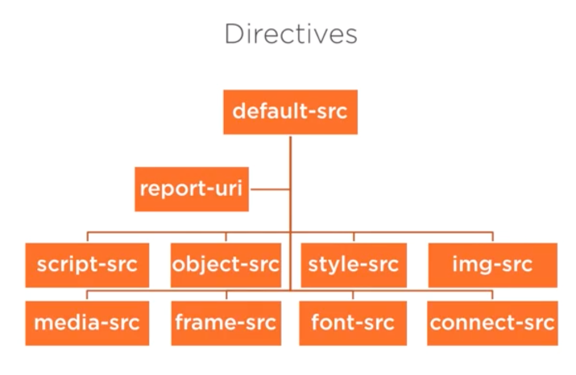

### [Defeating XSS with Content Security Policy](https://app.pluralsight.com/library/courses/c478106f-5ffb-4c65-9bf5-af49b0815c61/table-of-contents)

#### Concepts

##### Affects
 - Inline scripts do not work (`
  - <input type="text" value="" ">  />
 
##### JS Security Model (Same Origin)
 - origin:  protocol + domain + port (http://google.com:80)
 - origin of javascript code (yours, jquery, etc) is always the origin of the html page that included or loaded your script 
 
#### What

Header + Directives
 
- Content-Security-Policy: default-src='self'; img-src='...'
 - 'self' = current origin
 - 'unsafe-inline' = anything that is inlined
 - 'unsafe-eval' = loaded lazily

 - default-src: sets value that all children will inherit from
 - report-uri: tells you when something has violated
 - object-src: java applets, flash, etc
 - connect-src: where can js connect to (ajax, etc) can limit scheme, url and port or any subset of them
 
 
 